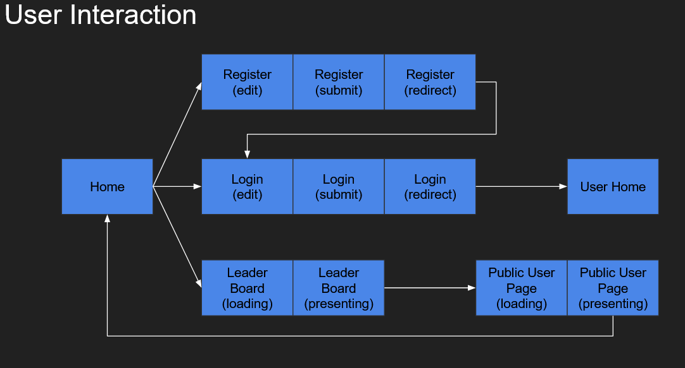
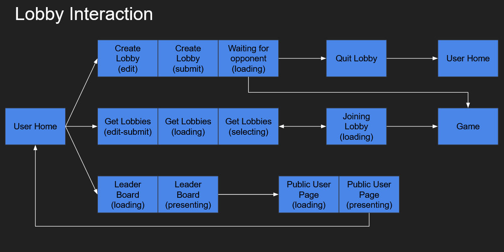
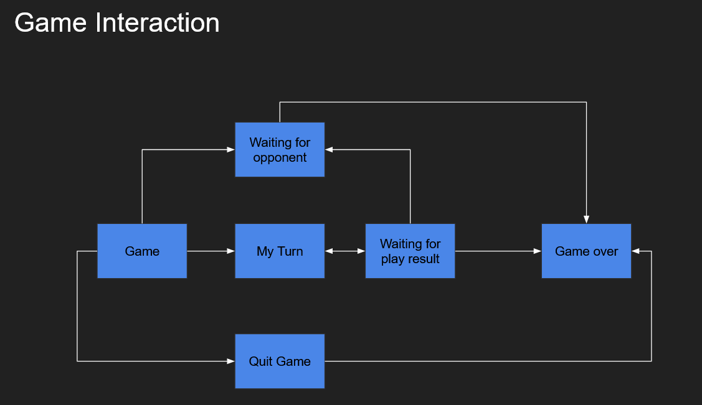

# DAW Project Report
#### Autumn/Winter 2023/24 - LEIC52D 
#### Group: G05_2

----

## Introduction

This project can be described as a containerized Gomoku (five-in-a-row) game, accessible through a web application. 
The **backend**, developed with `Spring Boot` in `Kotlin`, establishes an `HTTP API` for user interaction and authentication. 
It employs a `PostgresSQL` **database** to store game and user related data and contains the Gomoku game logic. On the **frontend**, `React.js `
with `TypeScript` is utilized to craft a user-friendly interface, allowing authenticated users to engage in Gomoku matches. 
The integration of these two parts aims to provide an immersive and secure platform for users to enjoy playing Gomoku against each other.

## Backend Organization

### Database

The database holds all the essential game and user information, including authentication.
Its **physical model** can be found here: [`code/gomoku_web_app/src/main/sql/create_schema.sql`](https://github.com/isel-leic-daw/2023-daw-leic52d-g05-52d/blob/main/code/gomoku_web_app/src/main/sql/create_schema.sql).

A few aspects to highlight:

* The users who are in a game are stored in a separate table called `game_users`;
* Some of the stored information is serialized, an example would be the property `board` inside the table `games`.

### API Documentation

All the `API` endpoints and their usages are specified in the following documentation:
[API Documentation](https://github.com/isel-leic-daw/2023-daw-leic52d-g05-52d/blob/main/docs/gomoku_api_doc.md)

### Request Process

Through the usage of the Spring Boot Framework, requests are received at the functions present in the `RestControllers`.

There are three main controllers:
 - [`GameController`](https://github.com/isel-leic-daw/2023-daw-leic52d-g05-52d/blob/main/code/gomoku_web_app/src/main/kotlin/daw/isel/pt/gomoku/controllers/GameController.kt)
 - [`LobbyController`](https://github.com/isel-leic-daw/2023-daw-leic52d-g05-52d/blob/main/code/gomoku_web_app/src/main/kotlin/daw/isel/pt/gomoku/controllers/LobbyController.kt)
 - [`UserController`](https://github.com/isel-leic-daw/2023-daw-leic52d-g05-52d/blob/main/code/gomoku_web_app/src/main/kotlin/daw/isel/pt/gomoku/controllers/UserController.kt)

In each controller, in order to perform the required tasks, is specified its respective **service**. 

Each controller function is linked to a **route** and its defined **HTTP Method**, also retaining the necessary **request content**.

As for the result of each request, each controller function calls a function belonging to the specified service, determining 
the final return value, which is of the type `ResponseEntity`, containing inside, a specified class that can be manipulated through utility functions.
This result may also be a thrown exception, inside a `ResponseEntity`.

- **Return Classes:** [`code/gomoku_web_app/src/main/kotlin/daw/isel/pt/gomoku/controllers/models/Model.kt`](https://github.com/isel-leic-daw/2023-daw-leic52d-g05-52d/blob/main/code/gomoku_web_app/src/main/kotlin/daw/isel/pt/gomoku/controllers/models/Model.kt)
- **Utility Functions:** [`code/gomoku_web_app/src/main/kotlin/daw/isel/pt/gomoku/controllers/utils/Utils.kt`](https://github.com/isel-leic-daw/2023-daw-leic52d-g05-52d/blob/main/code/gomoku_web_app/src/main/kotlin/daw/isel/pt/gomoku/controllers/utils/Utils.kt)

### Services

Services are defined in the Spring Framework as a `@Component` and operate the necessary logic behind each task issued by a request, 
checking for possible errors, such as invalid information or non-existent content, in which case an exception is thrown.

There are three main service components:
- [`GameServices`](https://github.com/isel-leic-daw/2023-daw-leic52d-g05-52d/blob/main/code/gomoku_web_app/src/main/kotlin/daw/isel/pt/gomoku/services/GameServices.kt)
- [`LobbyServices`](https://github.com/isel-leic-daw/2023-daw-leic52d-g05-52d/blob/main/code/gomoku_web_app/src/main/kotlin/daw/isel/pt/gomoku/services/LobbyServices.kt)
- [`UserServices`](https://github.com/isel-leic-daw/2023-daw-leic52d-g05-52d/blob/main/code/gomoku_web_app/src/main/kotlin/daw/isel/pt/gomoku/services/UserServices.kt)

Each service contains its own **transaction manager** of the type `TransactionManager`, except for the `UserServices` component, which contains not only the manager but also
a **_clock_** parameter of the type `Clock` and a **_usersDomain_** parameter of the type `UserLogic`, these two additional parameters have the 
purpose of managing the user's **security and authentication**. 
The `UserLogic` class contains the necessary methods to **generate** and **validate** **encoded** user **tokens** and **passwords**, the clock parameter serves the
purpose of **token** **expiration**, for which `UserLogic` can **validate** the token's **elapsed time**.

Each service function calls **repository** functions in order to **retrieve, create, alter or delete** data from the **database**, this call
is made inside the function's return handler, the transaction manager, which ultimately returns a value with the function's specified
return class or an exception, in case a service check fails or an internal server error occurs.

The `TransactionManager` interface is a generic way of calling repository functions, it contains the following function:

```kotlin
fun <R> run(block: (Transaction) -> R): R
```

This function allows the return of any type (`R`) and executes the given block, which receives a `Transaction`, this received interface
contains all existing data repositories, with their respective functions.

### Data Access

There are three main repository interfaces:
- [`GameRepository`](https://github.com/isel-leic-daw/2023-daw-leic52d-g05-52d/blob/main/code/gomoku_web_app/src/main/kotlin/daw/isel/pt/gomoku/repository/interfaces/GameRepository.kt)
- [`LobbyRepository`](https://github.com/isel-leic-daw/2023-daw-leic52d-g05-52d/blob/main/code/gomoku_web_app/src/main/kotlin/daw/isel/pt/gomoku/repository/interfaces/LobbyRepository.kt)
- [`UserRepository`](https://github.com/isel-leic-daw/2023-daw-leic52d-g05-52d/blob/main/code/gomoku_web_app/src/main/kotlin/daw/isel/pt/gomoku/repository/interfaces/UserRepository.kt)

Each holds function definitions for all the application operations.

The database interaction is made possible through the utilization of the `JDBI` library, 
instanced as a Spring `@Bean` inside the [_GomokuApplication_](https://github.com/isel-leic-daw/2023-daw-leic52d-g05-52d/blob/main/code/gomoku_web_app/src/main/kotlin/daw/isel/pt/gomoku/GomokuApplication.kt) file.

The `JDBI` data access logic and manipulation can be found here: [`code/gomoku_web_app/src/main/kotlin/daw/isel/pt/gomoku/repository/dataJDBI`](https://github.com/isel-leic-daw/2023-daw-leic52d-g05-52d/tree/main/code/gomoku_web_app/src/main/kotlin/daw/isel/pt/gomoku/repository/dataJDBI)

Inside this folder can be found data mappers, `JDBI` transaction classes, which extend the `TransactionManager` and `Transaction` 
interfaces mentioned earlier, and the three main `JDBI` data classes:
- [`GameDataJDBI`](https://github.com/isel-leic-daw/2023-daw-leic52d-g05-52d/blob/main/code/gomoku_web_app/src/main/kotlin/daw/isel/pt/gomoku/repository/dataJDBI/GameDataJDBI.kt)
- [`LobbyDataJDBI`](https://github.com/isel-leic-daw/2023-daw-leic52d-g05-52d/blob/main/code/gomoku_web_app/src/main/kotlin/daw/isel/pt/gomoku/repository/dataJDBI/LobbyDataJDBI.kt)
- [`UsersDataJDBI`](https://github.com/isel-leic-daw/2023-daw-leic52d-g05-52d/blob/main/code/gomoku_web_app/src/main/kotlin/daw/isel/pt/gomoku/repository/dataJDBI/UsersDataJDBI.kt)

These classes extend their respective previously mentioned repository interfaces, implementing all of their functions, where
**connections** to the database are made, allowing data retrieval, creation, alteration and deletion. 
The received information from the connection is handled and converted in order to allow its use in other modules.

> Note: Some of the data written to the database is serialized for optimization, which is then deserialized when received back by the application 

### Exceptions

All thrown exceptions are handled by an `HTTPExceptionHandler`, configured with the Spring annotation `@ControllerAdvice`.

Handler location: [`code/gomoku_web_app/src/main/kotlin/daw/isel/pt/gomoku/controllers/httpexception/HTTPExceptionHandler.kt`](https://github.com/isel-leic-daw/2023-daw-leic52d-g05-52d/blob/main/code/gomoku_web_app/src/main/kotlin/daw/isel/pt/gomoku/controllers/httpexception/HTTPExceptionHandler.kt)

This handler contains functions with the Spring annotation `@ExceptionHandler`, which receives the **possible** thrown exception types.
These functions return response entities of the same type used in the controllers, `ResponseEntity`, so that the thrown exceptions 
can be manipulated and outputted by the application.

Regarding all functions, depending on their context and received exception, within the possibilities defined by the annotation `@ExceptionHandler`,
there are four possible `HTTP Status` values which can be returned, along with the message provided or not by the exception:
- `NOT_FOUND`
    - Derived from the class `NotFoundException`
- `BAD_REQUEST`
    - Derived from the classes:
        - `AlreadyInLobbyException`
        - `IllegalArgumentException`
        - `InvalidCredentialsException`
        - `GameError`
- `UNAUTHORIZED`
    - Derived from the class `UnauthorizedException`
- `INTERNAL_SERVER_ERROR`
    - Derived from the class `SQLException`

> Note: The `GameError` is an `Exception` extended class used specifically for game-related errors

All the application's **custom exceptions** can be found here: [`code/gomoku_web_app/src/main/kotlin/daw/isel/pt/gomoku/services/exceptions/Exceptions.kt`](https://github.com/isel-leic-daw/2023-daw-leic52d-g05-52d/blob/main/code/gomoku_web_app/src/main/kotlin/daw/isel/pt/gomoku/services/exceptions/Exceptions.kt)

There are three custom exception message objects utilized for better comprehension and consistency:
- [`GameErrorMessages`](https://github.com/isel-leic-daw/2023-daw-leic52d-g05-52d/blob/main/code/gomoku_web_app/src/main/kotlin/daw/isel/pt/gomoku/services/exceptions/GameErrorMessages.kt)
- [`LobbyErrorMessages`](https://github.com/isel-leic-daw/2023-daw-leic52d-g05-52d/blob/main/code/gomoku_web_app/src/main/kotlin/daw/isel/pt/gomoku/services/exceptions/LobbyErrorMessages.kt)
- [`UserErrorMessages`](https://github.com/isel-leic-daw/2023-daw-leic52d-g05-52d/blob/main/code/gomoku_web_app/src/main/kotlin/daw/isel/pt/gomoku/services/exceptions/UserErrorMessages.kt)

### Authorization

The application uses a secure token-based authentication for user access with `HTTP-Only` cookie storage. 

When creating a user, the user services ensure a **strong password check** along with **encoding**. The **encoded password** is **stored** inside the
database.

Users authenticate using their **email** and **password**, and upon successful login, a unique `Bearer Token` is generated 
and a **new cookie** is created with it, deleting any previous cookie. 
This token is then used for subsequent authenticated requests. 

This token is **encoded** and **stored** in the database. On **logout**, the **cookie is deleted** and the user **token is removed from the database**.

To enhance security, tokens have a defined expiration period, requiring users to re-authenticate after a certain time.

A **configuration** is present in the application, annotated with the Spring annotation `@Configuration`, which adds the necessary 
request authentication interceptors to the three main controllers

This configuration can be found here: [`code/gomoku_web_app/src/main/kotlin/daw/isel/pt/gomoku/controllers/config/UserConfig.kt`](https://github.com/isel-leic-daw/2023-daw-leic52d-g05-52d/blob/main/code/gomoku_web_app/src/main/kotlin/daw/isel/pt/gomoku/controllers/config/UserConfig.kt)

## Frontend Organization

### Website State Machine





### Application

As mentioned in the introduction, the frontend application uses `React.js`, 
alongside `TypeScript` to provide a user-friendly web interaction with the `API`.

The visual styling and responsiveness is enhanced by incorporating `Bootstrap` and custom `CSS`.

All the API routes are defined in the following file: [`code/gomoku_web_app/js/js-react/src/assets/tsx/api-routes/api_routes.tsx`](https://github.com/isel-leic-daw/2023-daw-leic52d-g05-52d/blob/main/code/gomoku_web_app/js/js-react/src/assets/tsx/api-routes/api_routes.tsx)

The application's main function, alongside with all the web routes are defined in the following file: [`code/gomoku_web_app/js/js-react/src/assets/tsx/router.tsx`](https://github.com/isel-leic-daw/2023-daw-leic52d-g05-52d/blob/main/code/gomoku_web_app/js/js-react/src/assets/tsx/router.tsx)

### Website Features
- User Hub (Creation, Login, Logout, Profile)
- Secure and Authenticated Navigation
- Lobby and Game Creation
- Multiplayer Game Sessions
- Quit Lobby/Game
- Leaderboard
- Lobby Wait Timeout
- Paging
- Session Persistence
- Browser Cookie Storage

## Docker

This project uses `Docker` to join both the **backend** and **frontend** into one main **containerized
web application** with a **singular start** point.

`nginx` is used for load-balancing optimization, defining the **main app address** as `localhost:8080`.

**Dockerfile:** [`code/gomoku_web_app/Dockerfile-spring`](https://github.com/isel-leic-daw/2023-daw-leic52d-g05-52d/blob/main/code/gomoku_web_app/Dockerfile-spring)

**Docker Compose file:** [`code/gomoku_web_app/docker-compose.yml`](https://github.com/isel-leic-daw/2023-daw-leic52d-g05-52d/blob/main/code/gomoku_web_app/docker-compose.yml)

Execution instructions can be found here: [`code/gomoku_web_app/README.md`](https://github.com/isel-leic-daw/2023-daw-leic52d-g05-52d/blob/main/code/gomoku_web_app/README.md)

## Missing Features

- More Gomoku openings and variants
- More efficient paging handling
- Game timeout


